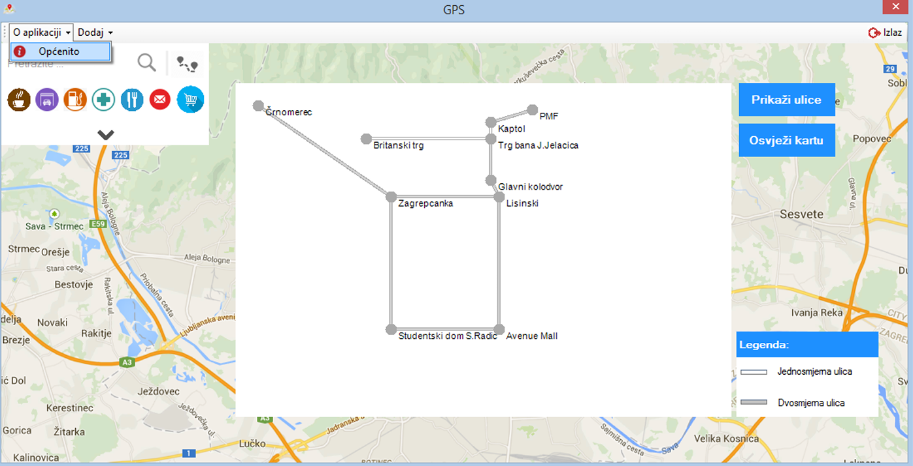

⚠️ Note: This project was developed as a student assignment, and the code may not follow current best practices. 
🤝 Collaboration with Dajana Jerončić, Mihaela Gamulin  
📅 Date: 2019  

## Student project for the course "Računarski praktikum 3" at PMF Zagreb, 2019.

# 🗺 GPS

This application contains a map of the city of Zagreb. The map consists of nodes representing intersections, squares, or important locations, and edges representing streets (either one-way or two-way).

It is possible to add new nodes by specifying coordinates, as well as new edges by entering the starting and ending nodes. Each node and edge can have associated characteristics such as a shop, restaurant, café, post office, pharmacy, garage, or gas station.

Details about each node and edge are stored in a database and can be displayed upon user request. As a basic feature, when searching for a specific location, its position is shown on the map, and additional detailed information about its characteristics can then be accessed.

Users can also find the shortest path from location A to location B, including detailed instructions about the total distance and the street names along the route. Additionally, users can calculate a route between two locations that includes a stop at a selected point of interest (based on a specified characteristic).

Upon request, the map can highlight all streets and nodes that contain a chosen characteristic.

